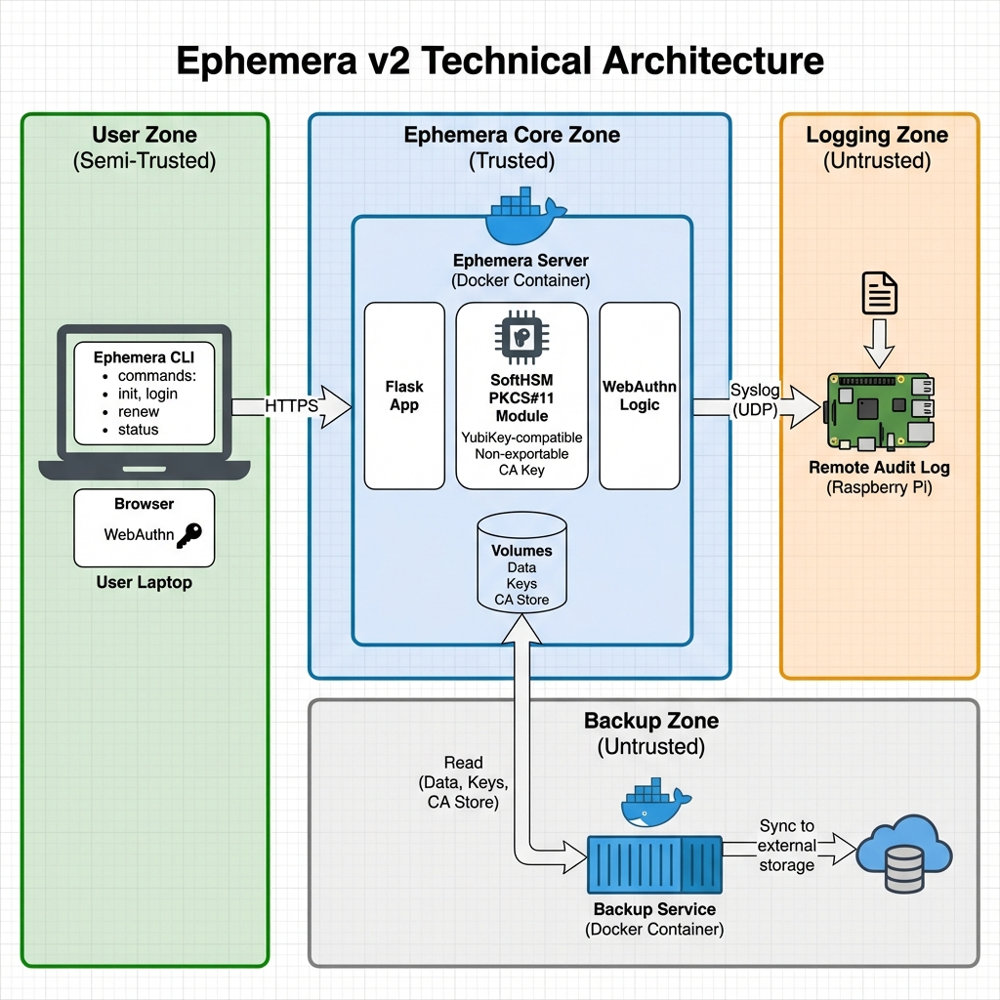
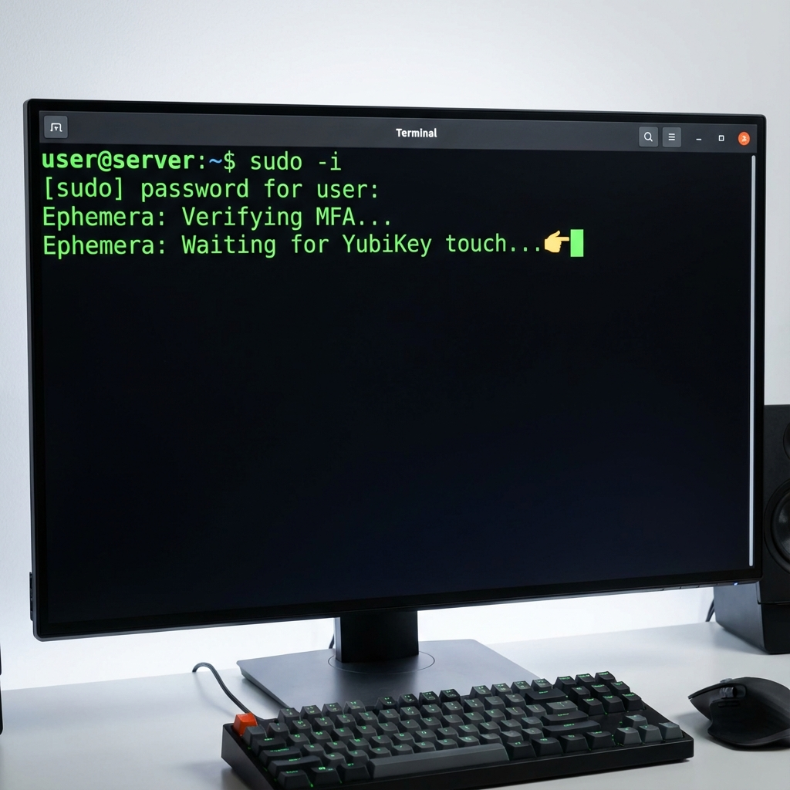

# Ephemera — Zero-Trust SSH Certificate Authority

[](https://github.com/ephemerassh/ephemera/actions/workflows/ci.yml)


**Ephemera** is a lightweight, self-hosted SSH Certificate Authority designed to enforce Zero-Trust access for infrastructure. It replaces static SSH keys with short-lived certificates, integrates hardware-backed WebAuthn MFA, and maintains cryptographically verifiable audit trails.

> [!NOTE]
> **Canonical Source**: [Codeberg](https://codeberg.org/Qarait1/ephemera)  
> **GitHub Mirror**: [GitHub](https://github.com/Qarait/ephemera) (for availability and hosting)



## What Ephemera Is

Ephemera is a self-hosted SSH Certificate Authority built on native OpenSSH features.
It replaces long-lived SSH keys with short-lived certificates issued just-in-time,
with explicit physical presence and auditable privilege escalation.

It is designed for teams that want centralized SSH governance without
MITM proxies, custom protocols, or cloud dependencies.

## What Ephemera Is Not

- Not an SSH proxy or MITM gateway
- Not a PAM replacement
- Not a runtime monitoring or behavior analysis tool
- Not a cloud service
- Not a SIEM or detection platform

## Why Ephemera?

Traditional SSH relies on long-lived private keys spread across laptops and servers. Once a key leaks, access persists until you discover it and rotate keys everywhere. Ephemera replaces static keys with short-lived certificates that expire automatically, shrinking the window of misuse from months to minutes.

## Positioning

### Best For
- **Sovereign Deployments**: Teams requiring full ownership of their CA without external cloud dependencies.
- **Air-Gapped Environments**: Designed to operate without outbound internet access once deployed.
- **Minimal Overhead**: Organizations that need strong SSH security without the complexity of managing a full secrets platform.

### Not For
- **Enterprise IAM Consolidation**: If you require deep integration with complex AD/LDAP hierarchies, **Teleport** or **HashiCorp Vault** are better suited.
- **Managed Service Preference**: Ephemera is self-hosted and does not offer a SaaS variant.

## Key Capabilities

- **Just-in-Time Access**: Certificates expire in minutes (default 5m), reducing the window of opportunity for stolen credentials.
- **WebAuthn Enforcement**: Certificate issuance requires physical MFA (FIDO2) interaction via YubiKey or TouchID.
- **Sovereign Recovery**: Encrypted backups are protected via Shamir's Secret Sharing, requiring a quorum to restore.
- **Verifiable Audit**: All CA actions are logged to a Merkle-chained ledger for tamper-evident history.
- **Granular RBAC**: A YAML-based policy engine defines access based on roles, resources, and conditions.



## Experimental: Trust Budgeting (Opt-in)

Ephemera includes an experimental, opt-in governance primitive called Trust Budgeting.

Trust Budgeting limits cumulative privileged authority at certificate issuance time by treating access as a finite, visible resource. Each certificate issuance consumes an explicit budget. When the budget is exhausted, normal issuance stops until the budget resets or a separate emergency (break-glass) path is used.

This mechanism:
- operates only at certificate issuance time
- introduces no runtime monitoring or agents
- is disabled by default
- is not a security guarantee

Trust Budgeting is experimental and may change or be removed.

**Documentation**: [docs/trust_budgeting.md](docs/trust_budgeting.md)

## Quick Start


### 1. Server Setup (Docker)

**Prerequisites:** Docker and Docker Compose.

1.  **Start the service:**
    ```bash
    docker compose up --build -d
    ```

2.  **Access the Dashboard:**
    Open [http://localhost:3000](http://localhost:3000) in your browser.

3.  **Login:**
    -   **Username:** `admin`
    -   **Password:** (Check the Docker logs for the initial one-time password)
        ```bash
        docker compose logs ephemera | grep "Password:"
        ```

### 2. Client Setup (The Magic)

```bash
# Install the CLI
pip install ephemera-cli  # (Coming soon to PyPI)

# Initialize your SSH config
ephemera init

# Login to the CA
ephemera login

# Issue your first certificate
ephemera renew

# Check your status
ephemera status

# Connect securely!
ssh user@your-server
```

## Disaster Recovery (Encrypted Backup)

Ephemera provides a secure backup mechanism that encrypts your critical data (CA keys, database) with a random password, and then splits that password into Shamir shards. This ensures that no single person can restore the backup, but a quorum can.

### Create Backup
```bash
# Create encrypted backup and split password into 5 shards (threshold 3)
ephemera backup-create --k 3 --n 5 --out-dir ./backup
```
This produces:
- `ephemera_backup.enc` (The encrypted archive)
- `backup_shard_1_of_5.json`, etc. (The password shards)

**Note:** Store the shards in separate, secure locations. Store the encrypted backup file safely (it is useless without the shards).

### Restore Backup
```bash
# Restore using the encrypted file and any 3 shards
ephemera backup-restore --backup ./backup/ephemera_backup.enc --shards ./backup/backup_shard_1_of_5.json ./backup/backup_shard_2_of_5.json ./backup/backup_shard_4_of_5.json --out-dir ./restored
```

## Configuration Example (`policy.yaml`)

Ephemera uses a powerful YAML-based policy engine for Role-Based Access Control (RBAC).

```yaml
# Define Roles
roles:
  developer:
    can_request_cert: true
    max_cert_duration: 300  # 5 minutes
    allowed_principals: ["dev-user"]
    
  admin:
    can_request_cert: true
    max_cert_duration: 3600 # 1 hour
    allowed_principals: ["root", "admin"]
    can_approve_sudo: true

# Define Rules
rules:
  # Developers can only access dev servers
  - role: developer
    resource: "dev-*"
    action: "ssh"
    effect: allow

  # Admins can access everything with MFA
  - role: admin
    resource: "*"
    action: "ssh"
    effect: allow
    conditions:
      mfa_required: true
```

## Documentation
- See [ARCHITECTURE.md](ARCHITECTURE.md) for design details.
- See [SECURITY_MODEL.md](SECURITY_MODEL.md) for threat assumptions and trust boundaries.
- See [docs/](docs/) for additional guides.

## Security
Please see [SECURITY.md](SECURITY.md) for responsible disclosure information.

Looking to contribute? Check out our [Small Tasks for New Contributors](CONTRIBUTING.md#small-tasks-for-new-contributors).

> [!TIP]
> **Threat model and security assumptions are documented [here](SECURITY_MODEL.md). Feedback and critique are welcome.**
